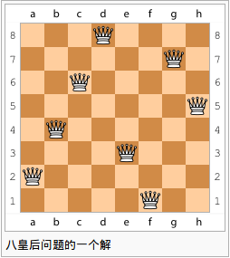
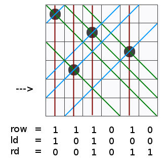
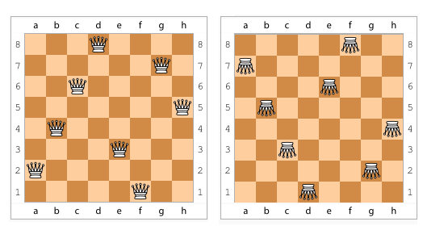
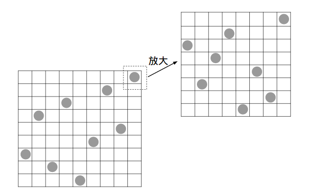

N皇后问题
=========

## 问题简述
在一个N×N的（国际）棋盘上，放置N个棋子（皇后），使得N个棋子中任意2个都不在同一行、同一列以及同一斜线。
问：放置这N个棋子的方法共有多少种？

如<sup>[1]</sup>下图为八皇后问题的一个解：



## 问题求解

### 一般解决思路

使用一个N×N的矩阵A（二维数组）来模拟棋盘，a<sub>ij</sub> = 0或1。0表示棋盘上没有棋子，1表示棋盘上有棋子（i表示行，j表示列）。

也可以使用一个一维数组（a[N]）来存储棋子的放法，即a[i]表示第i行棋子在第几列。这样便可保证所有的棋子都不存在行冲突了。

使用回溯法来暴力搜索所有的情况。具体实现有递归和非递归两种办法。

#### 递归法

逐一查找每一行能放皇后的位置。找到第 i 行的解的前提是前 i-1 行都放好了皇后，找到第 N 行的时候，递归结束。

python代码如下：

```python
#filename nqueen-recurssion.py
#-*- coding:utf-8 -*-
def available(row,col):
    """检查当前位置是否合法"""
    for k in range(row):
        if queen[k]==col or queen[k]-col == k - row or queen[k]-col == row - k:
            return False
    return True

def find(row):
    """当row == n时表明已放置了n个皇后，递归结束，记录一个解"""
    global count,n,queen
    if row == n:
        count += 1
    else:
        for col in range(n):
            if available(row,col):
                queen[row]=col
                find(row+1)

def main():
    global count,n,queen
    n = input()
    queen = [-1]*n
    count = 0 
    find(0)
    print count

if __name__ == "__main__":
    main()
```

计算12皇后所用时间:

```bash
$ time echo 12 | python nqueen-recurssion.py 
14200

real	0m13.067s
user	0m13.029s
sys 	0m0.012s
```
#### 非递归法

与递归法相同，都是逐一查找每一行的解。不同的是，需要自己处理何时回溯及如何回溯。

算法描述如下：

1. 开始时清空棋盘，将当前行设为第零行，当前列设为第零列。
2. 判断当前位置是否合法，若不合法到第4步。
3. 当前位置合法，则在当前位置放置一棋子。

	* 若当前行为最后一行，则记录一个解。
		* 若当前列是最后一列，当前行设为前一行，当前列设为当前行对应列的下一列。
		* 若当前列不是最后一列，当前列设为下一列。
	* 若当前行不是最后一行，则将当前行设为下一行，当前列设为第零列。
   
   回至第2步。
4. 当前位置不合法。

	* 若当前列不是最后最后一列，则当前列设为下一列，回到第2步。
	* 若当前列是最后一列
		* 若当前行为第零行，结束
		* 若当前不是第零行，当前行设为前一行，当前列设为当前行对应列的下一列。

   回至第2步。

python代码如下：

```python
#filename nqueen-norecurssion.py
#-*- coding:utf-8 -*-
def available(row,col):
    """检查当前位置是否合法"""
    for k in range(row):
        if queen[k]==col or queen[k]-col == k - row or queen[k]-col == row - k:
            return False
    return True

def find(n):
    """回溯法求解"""
    count = 0
    row = 0
    global queen
    queen[row] = 0
    while row >=0 : #当前行为 -1 时结束
        if row < n and queen[row] < n: #当前行、当前列均为到达最后
            if available(row,queen[row]): #当前位置合法，则探索下一行
                row += 1
                queen[row] = 0
            else: #当前位置不合法，探测当前行的下一个位置
                queen[row] += 1
        else:
            if row >= n: #当前行、当前列均到了最后，记录一个解
                count += 1
            row -= 1 # 返回上一行，继续探索
            queen[row] += 1
    return count

def main():
    global queen
    n = input()
    queen = [-1]*(n+1)
    print find(n)

if __name__ == "__main__":
    main()
```
计算12皇后所用时间:

```bash
$ time echo 12 | python nqueen-backtrack.py 
14200

real	0m15.852s
user	0m15.805s
sys 	0m0.008s
```

### 用位运算来求解

<sup>[2]</sup>解决思路还是一行一行地查找。但是使用3个2进制数来存储列、左对角线、右对角线上不能下棋的位置。

如下图所示（1表示位置不合法）：



于是当前行所有不合法位置即为 `row | ld | rd` ，整体上加快了寻找合法位置的速度。

具体python实现如下：

```python
#filename nqueen-binary.py
#-*- coding:utf-8 -*-

def find(row, ld, rd):
    global n, upperlim,count
    if row == upperlim: #当row == upperlim时，所有列已有棋子，即产生一个解
        count += 1
    else:
        pos = upperlim & (~(row | ld | rd)) # pos二进制表示时，1代表该位可放棋子
        while pos: #有位置可放
            p = pos & (~pos + 1) #取出pos中最后一位1
            pos = pos - p #将取出的1（合法的位置）从pos中去除
            find(row | p, (ld | p) << 1, (rd | p) >> 1) #递归查找


def main():
    global n,upperlim,count
    n = input()
    upperlim = (1 << n) - 1 #表示N个1
    count = 0 
    find(0, 0 ,0) 
    print count

if __name__ == "__main__":
    main()
```

计算12皇后所用时间:

```bash
$ time echo 12 | python nqueen-binary.py 
14200

real    0m0.552s
user    0m0.540s
sys     0m0.008s
```

### 考虑问题的对称性

将8皇后其中一个解垂直翻转后，可以得到一个新的解，如图：



故，可以只计算一半，从而加快时间。

将nqueen-binary.py优化后，代码如下：

```python
#filename nqueen-binary-flip.py
#-*- coding:utf-8 -*-

def find(row, ld, rd):
    global n, upperlim,count
    if row == upperlim: #当row == upperlim时，所有列已有棋子，即产生一个解
        count += 1
    else:
        pos = upperlim & (~(row | ld | rd)) # pos二进制表示时，1代表该位可放棋子
        while pos: #有位置可放
            p = pos & (~pos + 1) #取出pos中最后一位1
            pos = pos - p #将取出的1（合法的位置）从pos中去除
            find(row | p, (ld | p) << 1, (rd | p) >> 1) #递归查找

def find_flip():
    global n,count
    pos = (1<< (n >> 1)) -1#只探索第一行后半列的情况
    while pos:
        p = pos & ( ~pos + 1)
        pos = pos - p
        find(p, p<< 1, p >> 1)
    count <<= 1 #将结果×2
    if n & 1 : #对于棋盘为奇数的情况，再探索一次第一行中间位置放子的情况
        p = 1 << (n >> 1)
        find(p, p<< 1, p >> 1)

def main():
    global n,upperlim,count
    n = input()
    upperlim = (1 << n) - 1 #表示N个1
    count = 0
    find_flip()
    print count

if __name__ == "__main__":
    main()
```
计算12皇后所用时间:

```bash
$ time echo 12 | python nqueen-binary-flip.py 
14200

real    0m0.299s
user    0m0.284s
sys     0m0.008s
```

## 探索

上面对回溯法的优化，当 N 比较大的时候，也只是杯水车薪。这是由于整个算法的基础是对所有可能解进行一一探索，而可能解的规模是在 N! 这样的量级的。尽管在整个计算过程中，会对部分可能解进行剪纸，以及利用对称性可减少探索量，但终究在 N 比较大的时候，对求解的速度毫无帮助。

比如我对 N = 18,19,20,21 时进行的测试：

<pre>
实验环境： Intel(R) Xeon(R) CPU E5450  @ 3.00GHz
程序： by Jeff Somers
实验说明：Jeff Somers 的算法同 nqueen-binary-flip.py 但使用 C 编写并使用 gcc 优化编译。
        该程序使用单线程。
实验结果：
N   Time
18  5m43s
19  44m28s
20  6h2m29s
21  51h30m26s
</pre>

根据<sup>[3]</sup>OEIS上序列 A000170 的资料显示，目前只计算到了 N = 26 时的解。而<sup>[4]</sup>这一计算是由 QUEENS@TUD 完成的，耗时达 9 个月。

## 当 N 比较大

由于对 A000170 序列找不到一个可递推的公式，而现在计算机的计算能力还无法对 N 比较大时求出所有解。

所以我们考虑 N 皇后问题可能的解。

首先看一个一个简单的例子 N = 720 时：

720 = 8 × 9 × 10

于是将问题化为 3 个子问题，分别是 8 皇后、 9 皇后、 10 皇后问题。

最后将 8 皇后的棋盘放置在 9 皇后的解的位置，将 9 皇后的棋盘放置在 10 皇后的位置，如此便构成了一个 720 皇后的解。



因此 720 皇后的解的个数： N(720) ≥ N(8) × N(9) × N(10)

像上述这样的方法便是 **分治法** ，然而这个方法只能找出其存在借而无法找出其所有解。

<sup>[5]</sup>利用分治法，理论上可以得到所有 N 皇后问题的一个或更多解（N ≠ 2,3,8,9,14,15,26,27,38,39）

## 参考
1. 图片来自 <http://zh.wikipedia.org/wiki/八皇后问题>
2. N皇后问题的两个最高效的算法 <http://blog.csdn.net/hackbuteer1/article/details/6657109>
3. A000170 - OEIS <http://oeis.org/A000170>
4. QUEENS@TUD <http://queens.inf.tu-dresden.de>
5. Abramson B, Yung M M. Construction through decomposition: A divide-and-conquer algorithm for the N-queens problem[C]//Proceedings of 1986 ACM Fall joint computer conference. IEEE Computer Society Press, 1986: 620-628.
## 备注
除注明外所有程序实验环境为：
1. 硬件 Intel(R) Core(TM) i5-2430M CPU @ 2.40GHz
2. 系统 Linux 3.2.0-51-generic #77-Ubuntu SMP Wed Jul 24 20:18:19 UTC 2013 x86_64 

